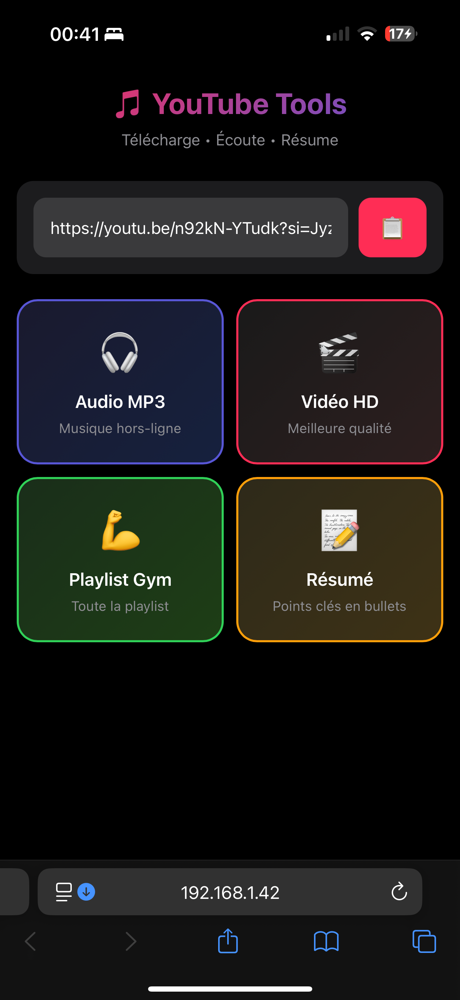

<p align="center">
  
</p>

<h1 align="center">🎵 YouTube Tools</h1>

<p align="center">
  <strong>Télécharge • Écoute • Résume</strong>
</p>

<p align="center">
  
  
  
</p>

<p align="center">
  Application web minimaliste optimisée pour <strong>iPhone Pro Max</strong><br>
  pour télécharger et résumer des vidéos YouTube.
</p>

---

## ✨ Fonctionnalités

| | Fonction | Description |
|:---:|:---|:---|
| 🎧 | **Audio MP3** | Télécharge l'audio en MP3 320kbps pour écouter hors-ligne |
| 🎬 | **Vidéo HD** | Télécharge la vidéo en meilleure qualité (MP4) |
| 💪 | **Playlist Gym** | Télécharge une playlist entière en MP3 |
| 📝 | **Résumé IA** | Génère un résumé en bullet points avec GPT-4 |

---

## 🚀 Installation

### Prérequis

- **Node.js 18+** - [nodejs.org](https://nodejs.org)
- **yt-dlp** - Outil de téléchargement

```bash
# macOS
brew install yt-dlp

# Ou avec pip
pip install yt-dlp
```

### Setup rapide

```bash
# Cloner le repo
git clone https://github.com/jbleroy75/Youtube-Tools.git
cd Youtube-Tools

# Installer les dépendances
npm install

# (Optionnel) Configurer OpenAI pour les résumés
cp .env.example .env
# Édite .env et ajoute ta clé OPENAI_API_KEY

# Lancer
npm start
```

---

## 📱 Accès depuis iPhone

1. Lance le serveur sur ton Mac
2. Trouve ton IP locale :
   ```bash
   ipconfig getifaddr en0
   ```
3. Sur ton iPhone, ouvre Safari → `http://<IP>:3000`
4. **Bonus** : Ajoute à l'écran d'accueil pour une expérience native !

---

## ☁️ Déploiement Cloud (Render)

Déploie gratuitement pour y accéder depuis n'importe où :

1. Fork ce repo
2. Va sur [render.com](https://render.com)
3. **New** → **Web Service** → Connecte ton repo
4. Ajoute la variable `OPENAI_API_KEY`
5. Deploy ! 🚀

[](https://render.com/deploy)

---

## 🔑 Configuration OpenAI

Pour les résumés automatiques, ajoute ta clé dans `.env` :

```env
OPENAI_API_KEY=sk-...
```

> Sans clé, le résumé affichera les sous-titres bruts.

---

## 🛠️ Stack technique

- **Backend** : Node.js + Express
- **Frontend** : HTML/CSS vanilla (optimisé iOS)
- **Téléchargement** : yt-dlp + ffmpeg
- **IA** : OpenAI GPT-4o-mini

---

## ⚠️ Notes

- Les fichiers sont supprimés après 24h
- Usage personnel uniquement
- Respecte les droits d'auteur

---

<p align="center">
  Made with ❤️ for gym sessions 💪
</p>
